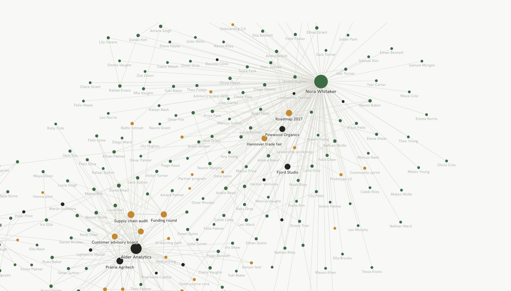
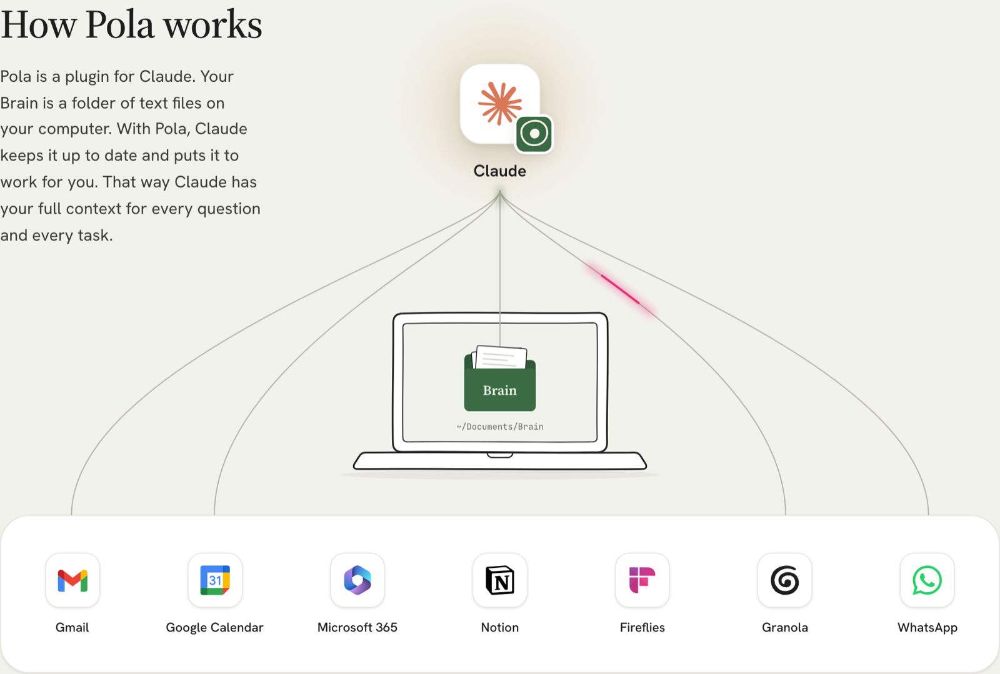
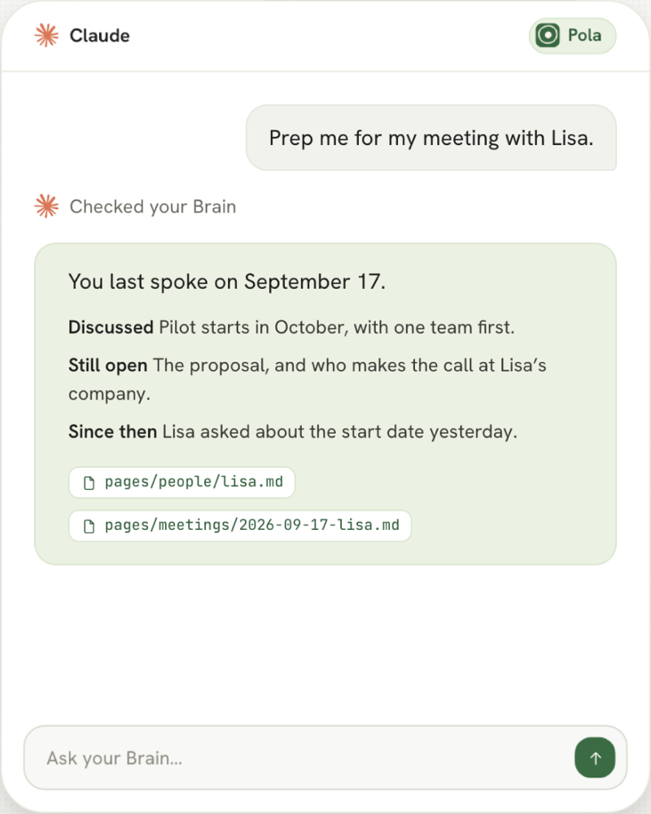
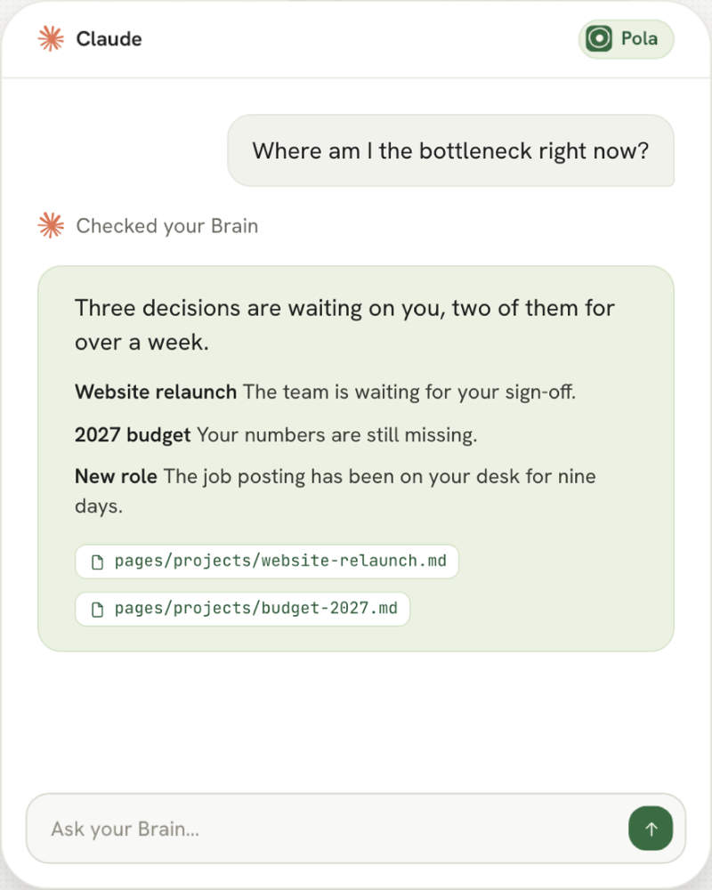
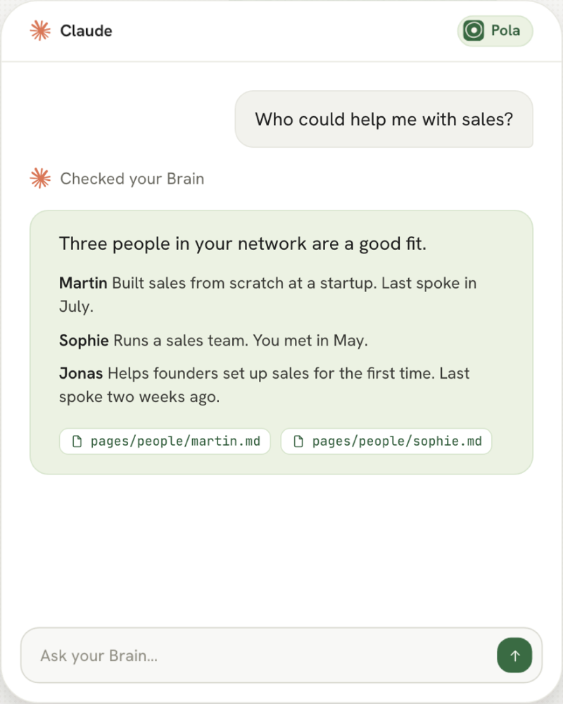
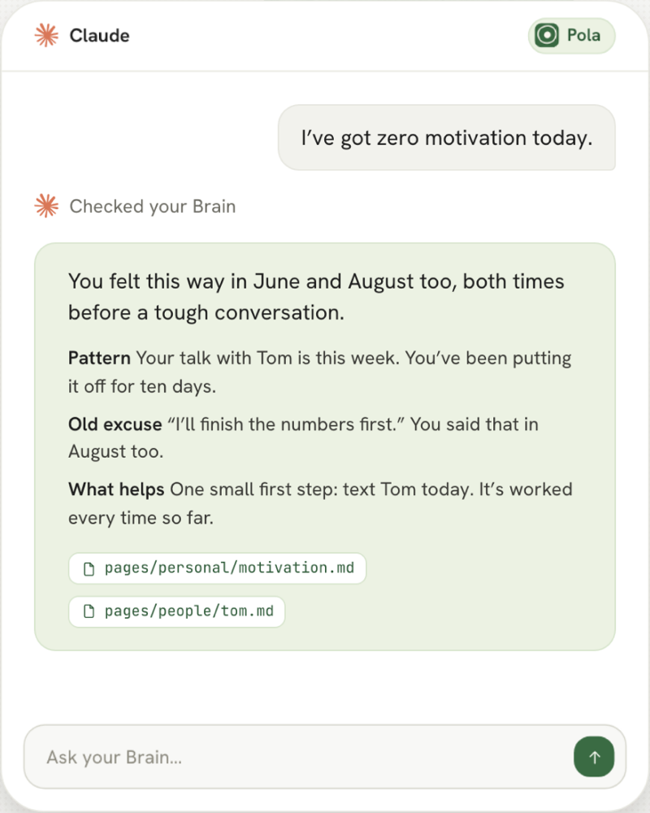
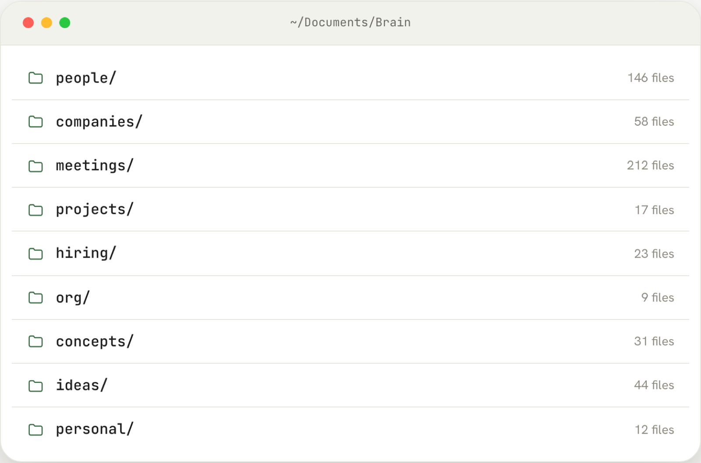

# Pola: a Second Brain plugin for Claude

**Bring the full context of your life to every decision, every conversation,
every next step.**

Your Second Brain knows your conversations, emails, notes and contacts. Claude
uses that context for every task, not just general knowledge. Set up in 30
minutes. No code needed.

Free. Your data stays with you. More at [pola.so](https://pola.so).



## Why you need a Second Brain

Your context is scattered across meeting transcripts, emails, calendars and
your own head, so ChatGPT or Claude can only answer from general knowledge.
A Second Brain collects it all in one place, so every answer is about your
work, your people and your decisions.

## How Pola works

Pola is a plugin for Claude. Your Brain is a folder of text files on your
computer. With Pola, Claude keeps it up to date and puts it to work for you.
That way Claude has your full context for every question and every task.



Claude fills your Brain from the tools you already use: Gmail, Google Calendar,
Microsoft 365, Notion, Fireflies, Granola, WhatsApp, a folder of notes, and
what Claude or ChatGPT already remember about you.

## What you can use your Brain for

<table>
  <tr>
    <td width="50%" valign="top">
      <b>Prep for meetings</b><br>
      Walk into every meeting knowing what you talked about last time, what's
      still open and what's happened since. Every morning, automatically.<br><br>
      
    </td>
    <td width="50%" valign="top">
      <b>Run your company</b><br>
      See which decisions are waiting on you and which projects are stuck,
      across everything your Brain knows.<br><br>
      
    </td>
  </tr>
  <tr>
    <td width="50%" valign="top">
      <b>Find the right people</b><br>
      Ask who in your network can help, and get people you actually know, with
      when you last spoke.<br><br>
      
    </td>
    <td width="50%" valign="top">
      <b>Get coached</b><br>
      Your Brain remembers your patterns, so Claude can point out what helped
      last time instead of giving generic advice.<br><br>
      
    </td>
  </tr>
</table>

## Your Brain is a folder on your computer

Every person, company, project and meeting gets its own Markdown file. So you
can always see what your Brain knows, and use it with any AI.

<p align="center">
  
</p>

Inside, the Brain has three layers:

- `sources/` holds the raw material: transcripts, emails, notes, imports.
- `pages/` holds the pages Claude compiles from the sources and keeps current:
  `people/`, `companies/`, `meetings/`, `projects/`, `deals/`, `hiring/`,
  `ideas/`, `concepts/`, `personal/` and a few more.
- `BRAIN.md` and `brain.yaml` hold the rules of your Brain. You and Claude
  improve them together.

### Everything is connected

Every dot is a file in your Brain: a person, a company or a project. Every
line is a link between two files, and every connection gets a name. The graph
at the top of this page is such a Brain: one person in the middle, more than a
hundred contacts around them, and the companies and projects in between.

## What makes Pola different

- **Your data stays with you.** Your Brain is a set of Markdown files on your
  computer. Nothing is sent to Pola. What goes to Claude is whatever you ask
  about in a chat, same as any other time you use Claude.
- **Not locked in.** The folder already works with Obsidian, and you can point
  ChatGPT, OpenClaw or Ollama at the same folder.
- **Your own files stay untouched.** Your Brain is set up next to your existing
  folders. Pola only makes copies.
- **No cleanup needed.** You can start right away.
- **Bring what you already have.** An existing Karpathy-style Second Brain is
  copied in and imported into your new Pola Brain.

## What's in the plugin

| Skill | What it does |
|---|---|
| `pola-onboard` | Sets up your Brain step by step, about 30 minutes |
| `pola-sync` | Connects sources and imports them: notes folders, Granola and other meeting transcripts, email, Notion |
| `pola-people` | Goes through the people who matter to you and captures what only you know about them |
| `pola-brain` | Answers questions from your Brain, adds what you tell it, checks and revises pages |
| `pola-meeting-prep` | Connects your calendar, briefs you on upcoming meetings and runs a daily morning prep |
| `pola-memory-migrate` | Brings in what Claude, ChatGPT or other assistants already remember about you |

You don't have to call the skills by name. Just talk to Claude, for example
*"Prep me for my meeting with Lisa"*, and the right skill takes over.

## Install

You add Pola to Claude as a marketplace and install it from there. This
repository is that marketplace. It only takes a few minutes.

### Claude Cowork

In the Claude app, no terminal needed.

1. Click **Customize** in the left sidebar.
2. Select **Plugins** at the top, click **Add** on the right, then
   **Add marketplace**.
3. Choose **Add from a repository**.
4. Enter `fylingpete/pola-plugin` and click **Sync**. Claude shows a red
   warning in that dialog for every marketplace.
5. Pola now shows up in the list of plugins. Click **Add**.
6. Start a new chat and send: *"Set up my Brain with Pola."*

### Claude Code

```bash
claude plugin marketplace add fylingpete/pola-plugin
```

```bash
claude plugin install pola@pola
```

Then start Claude Code and enter `/pola:pola-onboard`.

Full guides with screenshots: [pola.so/en/installation](https://www.pola.so/en/installation).

## FAQ

**How much does it cost?** The plugin is free.

**How long does it take?** 30 minutes to set up. To get the most out of your
Second Brain, plan on about 30 minutes a week for the next 4 to 6 weeks.
That's when you add what only lives in your head, like what you know about
people.

**Is my Brain stored in the cloud?** No. It's a folder of Markdown files on
your computer.

**I already have my own folder structure. How does that work?** Your Brain is
set up next to your existing folders. Your own folders and files are never
changed.

## About this repository

This repository contains exactly what you install: the skills, the hook, the
bundled command line tool `tools/pola.cjs` and the template for a new Brain.
Pola is developed in a separate repository; every finished version is
published here as a commit.

## Inspiration

Pola is inspired by [Andrej Karpathy's LLM Wiki](https://gist.github.com/karpathy/442a6bf555914893e9891c11519de94f)
and [GBrain by Garry Tan](https://github.com/garrytan/gbrain).

## License

Apache 2.0, see [LICENSE](LICENSE). Copyright 2026 Topformer GmbH. Notices for
bundled software are in [NOTICE](NOTICE).
